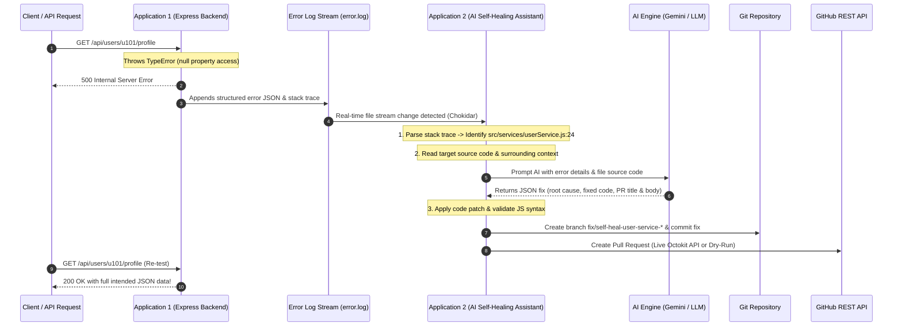

# 🤖 AI-Powered Self-Healing Developer Assistant

A production-ready, autonomous self-healing system built with **Node.js**, **Express.js**, and **AI (Google Gemini / LLM)**. The system monitors application error logs in real time, parses stack traces, fetches source code context, generates precise code fixes using AI, applies patches to the application codebase, creates Git feature branches, commits fixes, and automatically raises GitHub Pull Requests.

---

## 🏗️ System Architecture & Workflow



---

## 📁 Repository Directory Structure

```
ai-self-healing-assistant/
├── app1-demo-backend/                   # Application 1: Demo Backend Express API
│   ├── src/
│   │   ├── app.js                       # Express app setup & error handling middleware
│   │   ├── server.js                    # Server listener entry point (Port 4000)
│   │   ├── logger.js                    # Winston logger streaming JSON errors to file
│   │   ├── data/                        # Mock data stores (users.json, products.json)
│   │   ├── routes/                      # Domain API routes (users, orders, products)
│   │   └── services/                    # Business services containing intentional bugs
│   ├── logs/
│   │   ├── error.log                    # Target log file continuously monitored by App 2
│   │   └── pull-requests/               # Saved simulated PR payload artifacts
│   ├── package.json
│   └── .env.example
│
├── app2-self-healing-assistant/         # Application 2: Autonomous AI Self-Healing Assistant
│   ├── src/
│   │   ├── index.js                     # Main monitoring daemon entry point
│   │   ├── config.js                    # Configuration loader
│   │   ├── watcher/
│   │   │   └── logWatcher.js            # Real-time log stream watcher (chokidar)
│   │   ├── analyzer/
│   │   │   ├── stackParser.js           # Stack trace parser & deduplicator
│   │   │   └── contextReader.js         # Source code context extractor
│   │   ├── ai/
│   │   │   └── aiService.js             # LLM API caller (Gemini / OpenAI / Heuristic fallback)
│   │   ├── patcher/
│   │   │   └── codePatcher.js           # Safe patch applicator & syntax validator
│   │   ├── git/
│   │   │   └── gitService.js            # Simple-Git branch creator & committer
│   │   └── github/
│   │       └── prService.js             # GitHub Pull Request creator (Octokit / Dry-run)
│   ├── package.json
│   └── .env.example
│
├── scripts/
│   └── demo-runner.js                   # End-to-end automated demonstration runner
├── package.json                         # Root workspace package script runner
└── README.md
```

---

## ⚡ Functional Domain APIs & Real-World Bug Scenarios

### 1. User Profile API (`GET /api/users/:id/profile`)

- **Initial Request**: `GET http://localhost:4000/api/users/u101/profile`
- **Bug Scenario**: User `u101` has `preferences: null` in database JSON. The code attempts `user.preferences.displaySettings.theme.toUpperCase()`, throwing `TypeError: Cannot read properties of undefined (reading 'theme')`.
- **Healed Response**: Returns `200 OK` with full user profile JSON:
  ```json
  {
    "success": true,
    "data": {
      "id": "u101",
      "name": "Alice Smith",
      "email": "alice@example.com",
      "role": "USER",
      "settings": { "theme": "DEFAULT", "fontSize": 14 },
      "formattedTitle": "Alice Smith (USER) - Theme: DEFAULT"
    }
  }
  ```

### 2. Order Total Calculation API (`POST /api/orders/calculate`)

- **Initial Request**: `POST http://localhost:4000/api/orders/calculate` with `{ discountRate: 1.0 }`
- **Bug Scenario**: Code calculates divisor `(1.0 - discountRate)` resulting in division by zero.
- **Healed Response**: Returns `200 OK` with `{ subtotal: 100, discount: 100, tax: 0, total: 0, currency: "USD" }`.

### 3. Product Catalog Search (`GET /api/products/search`)

- **Initial Request**: `GET http://localhost:4000/api/products/search?tag=electronics`
- **Bug Scenario**: Product `p202` has unquoted raw metadata JSON string, causing `JSON.parse` to throw `SyntaxError`.
- **Healed Response**: Returns `200 OK` with product search array.

---

## 🛠️ Setup & Installation Instructions

### Prerequisites

- **Node.js**: v18.0.0 or higher
- **Git**: Installed and available in PATH

### Step 1: Install Dependencies

From the repository root directory, run:

```bash
npm run install:all
```

_(This installs dependencies for both `app1-demo-backend` and `app2-self-healing-assistant`)._

---

## 🚀 Running the System

### Option A: Running Manually (Two Terminals)

1. **Terminal 1: Start Application 1 (Backend)**:

   ```bash
   npm run start:app1
   ```

   _Server starts at `http://localhost:4000`._

2. **Terminal 2: Start Application 2 (Self-Healing Assistant)**:

   ```bash
   npm run start:app2
   ```

   _Assistant starts monitoring `app1-demo-backend/logs/error.log`._

3. **Trigger Bug & Observe Healing**:
   Open a browser or run cURL/Postman:
   ```bash
   curl http://localhost:4000/api/users/u101/profile
   ```

   - Terminal 1 outputs HTTP 500 error & appends to `error.log`.
   - Terminal 2 detects the error log, extracts stack trace, prompts AI, patches `src/services/userService.js`, creates git branch `fix/self-heal-user-service-...`, commits changes, and raises Pull Request!
4. **Re-Test Endpoint**:
   Run the cURL command again:
   ```bash
   curl http://localhost:4000/api/users/u101/profile
   ```
   _Returns `200 OK` with valid user profile JSON!_

---

### Option B: Automated One-Command Demo

Run the end-to-end automated verification runner:

```bash
npm run test:demo
```

This script automatically boots both services, fires a request to the buggy endpoint, verifies the initial HTTP 500 failure, waits for the Assistant to auto-heal the code, and verifies that the post-healing endpoint returns HTTP 200 OK with valid JSON!

---

## 🔑 Environment & Credentials Configuration

The assistant supports full integration with **Google Gemini 2.5 Flash API** and **GitHub Octokit REST API**.

Create a `.env` file in `app2-self-healing-assistant/`:

```env
# AI Model Key (Gemini API)
GEMINI_API_KEY=your_gemini_api_key_here

# GitHub Integration
GITHUB_TOKEN=ghp_your_github_personal_access_token
GITHUB_REPO_OWNER=your_github_username
GITHUB_REPO_NAME=ai-self-healing-assistant
GITHUB_BASE_BRANCH=main

# Mode Configuration
SIMULATE_PR=false
```

> 💡 **Note on Dry-Run / Simulated Mode**:
> If `GEMINI_API_KEY` or `GITHUB_TOKEN` is omitted, the assistant seamlessly runs in **Dry-Run / Local Simulation Mode**. The AI Engine utilizes a smart fallback rule system, and the GitHub PR service saves formatted PR JSON payload artifacts locally in `app1-demo-backend/logs/pull-requests/pr-*.json`. This ensures 100% testability offline or during evaluations without needing live API tokens!

---

## 🛡️ Production Readiness & Design Highlights

1. **Structured Log Parsing**: Parses stack traces with V8 line/column extraction, ignoring node internals and third-party dependencies.
2. **De-duplication & Cooldown**: Computes SHA-256 error hashes to prevent infinite self-healing loops or duplicate PR spam.
3. **Syntax Safety Guard**: Uses `node --check` to validate JavaScript syntax before finalizing code patches. Reverts to backup if invalid syntax is produced.
4. **Clean Modular Architecture**: Separation of concerns across log watcher, stack parser, context reader, AI service, code patcher, git manager, and PR creator.
